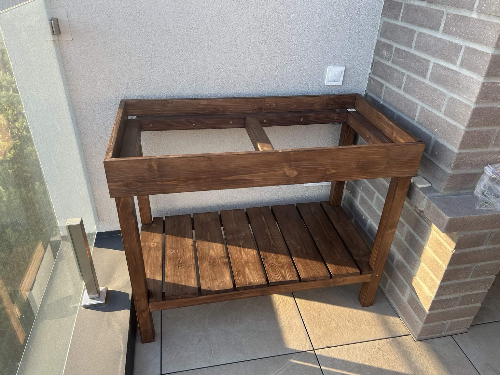
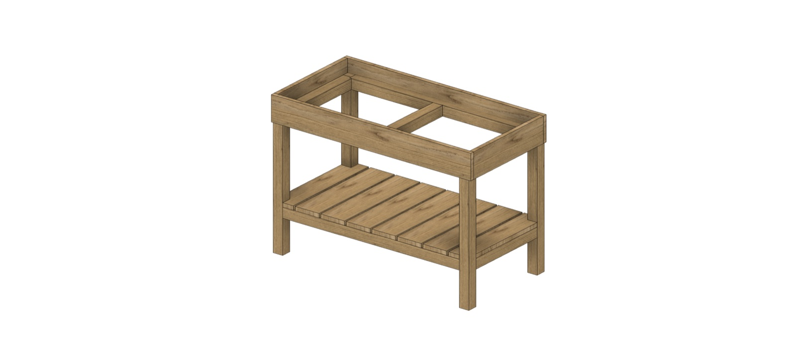

# Smart Garden Bed

A modular raised garden bed for a terrace, built around a permanent wooden
base and a removable planter box, with an ESP32-C3 controller planned for
soil/air monitoring and automatic drip irrigation.



This is a personal engineering project that spans mechanical design (Fusion
360), woodworking, electronics, and embedded firmware. It's also the first
complete embedded device I've built end to end, and this repository is
written to be honest about that: what's actually done, what's half-built,
and what's still just a plan on paper.

## The problem

Off-the-shelf raised beds are either too small, not built for a terrace
(no drainage/weight considerations for a load-bearing slab), or don't leave
room for sensors and irrigation plumbing. I wanted a bed that:

- fits a specific terrace corner instead of a generic footprint,
- can be emptied and stored over winter without dismantling the whole
  structure,
- has a service path for electronics so a failed sensor doesn't mean
  digging through soil to find it.

Buying a planter and bolting a moisture sensor to it doesn't solve any of
that — the mechanical design has to plan for it.

## Goals and constraints

- **Modularity**: the wooden base is permanent (stays on the terrace
  through winter); the planter box on top is removable, so soil can come
  out and the box can be stored separately.
- **Serviceability**: sensors and wiring must be replaceable without
  rebuilding the planter. At least two cable conduits are planned into the
  box — one in use, one spare.
- **No exposed mains voltage**: the only place 220 V AC exists is inside a
  certified external adapter. Everything inside the project's own
  enclosure runs at 12 V or 5 V.
- **Fail-safe irrigation**: the solenoid valve is normally closed, so a
  power loss or a firmware crash stops water flow instead of leaving it
  open.
- **Honesty over polish**: this README will not call the system
  "waterproof," "production-ready," or "fully automatic" until that's
  actually been tested and shown to work.

## Current status

| Area | Status |
|---|---|
| Wooden base (mechanical) | ✅ Completed |
| Fusion 360 model of the base | ✅ Completed and added to this repo |
| Removable planter box | 🚧 In progress |
| Drainage / geotextile liner | 🚧 In progress |
| Sensor conduits in the box | 🚧 Planning |
| Electronic components | ✅ Selected and ordered |
| Electronics prototyping / wiring | 📋 Planned |
| Firmware | 📋 Scaffold only, no working code yet |
| Soil moisture sensor calibration | 🧪 Not yet validated |
| Automatic irrigation | 📋 Planned — not implemented or tested |
| Home Assistant integration | 📋 Planned |
| Electronics enclosure (3D print) | 📋 Planned |

See [`docs/roadmap.md`](docs/roadmap.md) for the detailed breakdown and
[`docs/timeline.md`](docs/timeline.md) for the build log so far.

## System overview

```text
Fusion 360 design
        |
        v
  raw lumber
        |
        v
  wooden base (permanent, on the terrace)
        |
        v
  removable planter box  <-- currently being built
        |
        v
  electronics prototype (ESP32-C3, sensors, valve)  <-- not started
        |
        v
  automatic irrigation + Home Assistant  <-- planned
```

The base and the planter are deliberately separate structures. The base
was built first and finished (sanded, oiled, assembled in place); the box
is being fitted to the base's actual measured dimensions rather than to
the original CAD target, since a few millimeters of difference between a
3D model and a hand-built frame turned out to matter.

## Mechanical design

The base consists of four legs, a top load-bearing frame, a center
crossbeam, and a lower shelf built from individual slats. The mounting
frame that the removable planter box will sit in is part of the base.

Design and build notes:

- Pine lumber, sanded through multiple grits, finished with two coats of a
  "rosewood" (palisander) colored oil.
- Most fasteners are driven from the inside or underneath so they aren't
  visible from the outside — visible in the final photos, the top corners
  do use small metal corner brackets, which was a practical compromise on
  joint strength versus a fully fastener-free look.
- Every part was disassembled and hand-labeled (in Ukrainian, directly on
  the end grain) before finishing, specifically to avoid confusing pieces
  during reassembly. See [`docs/photos/assembly`](docs/photos/assembly) —
  this labeling turned out to be one of the more useful decisions in the
  build; see [`docs/lessons-learned.md`](docs/lessons-learned.md).



The Fusion 360 source (`.f3z`) and a render are now in this repository —
see [`mechanical/fusion360/README.md`](mechanical/fusion360/README.md). A
neutral STEP export isn't included yet, and the model hasn't been
reconciled against the finished base's real, measured dimensions.

Target dimensions at project start were roughly 1000 × 500 mm; see
[`mechanical/cut-list.md`](mechanical/cut-list.md) for why this is
documented as a target and not as a final spec.

## Electronics

Not yet assembled or wired — this section describes the plan, not a
working system.

| Function | Component | Notes |
|---|---|---|
| Controller | ESP32-C3 SuperMini (USB-C) | 1 required |
| Soil moisture | Capacitive soil moisture sensor × 2 | Analog, into ADC; not yet tested or calibrated |
| Soil temperature | Waterproof DS18B20, 2 m cable | 1-Wire; needs a 4.7 kΩ pull-up if not already on the module |
| Air temperature/humidity | AHT20 | I²C |
| Air pressure | BMP280 | I²C — this chip does **not** measure humidity |
| Irrigation valve | Normally Closed solenoid, DN15 / 1/2", 12 V DC | Driven through a MOSFET module; coil current and flyback protection still need to be verified |
| Power | External 220 V AC → 12 V DC adapter (~12 V, 2 A) + LM2596 buck to 5 V | No mains voltage inside the project's own enclosure |

Full bill of materials: [`electronics/bom.md`](electronics/bom.md).
Wiring, power, and pin-mapping plans (not yet finalized against the actual
board revision): [`electronics/wiring.md`](electronics/wiring.md),
[`electronics/power.md`](electronics/power.md),
[`electronics/pinout.md`](electronics/pinout.md).

## Firmware

No firmware exists yet — `firmware/` is intentionally empty for now. The
planned module breakdown (sensors, irrigation control, networking,
diagnostics) is documented in
[`docs/architecture.md`](docs/architecture.md), but no PlatformIO project
or code has been scaffolded. That will happen once electronics
prototyping starts and there's real hardware to write against.

## Irrigation

Planned, not built: 16 mm PE mainline, 4 mm microtube to individual
drippers, the DN15 solenoid valve at the inlet, and possibly a filter and
pressure reducer depending on the actual supply pressure. The hydraulic
layout isn't finalized. See [`electronics/irrigation.md`](electronics/irrigation.md).

## Repository structure

```text
docs/           Project documentation, timeline, photos
mechanical/     Fusion 360 model, exports, cut list, base assembly notes
planter/        Removable planter box: design, drainage, sensor conduits
electronics/    BOM, pinout, power, wiring, irrigation plumbing
firmware/       Reserved for the ESP32-C3 firmware (not started yet)
enclosure/      3D-printed electronics enclosure (design pending)
home-assistant/ Dashboard and automation configs (not started)
assets/         Hero images and diagrams used in docs
```

## Roadmap

See [`docs/roadmap.md`](docs/roadmap.md) for the full list. Short version
of what's next: finish the planter box, prototype the electronics on a
breadboard, write firmware against real hardware, calibrate the soil
sensors in dry/wet reference conditions, then — only after all of that
works reliably on a bench — wire up the valve and call it "automatic
irrigation."

## Lessons learned

A few things worth calling out now, with more detail in
[`docs/lessons-learned.md`](docs/lessons-learned.md):

- Building the base first and fitting the box to it afterward, instead of
  trusting the CAD dimensions blindly, avoided a mismatch between the
  model and the real, hand-cut lumber.
- Labeling every part before finishing made reassembly straightforward —
  cheap insurance against mixing up nearly-identical boards.
- Surface prep (sanding through grits, cleaning between coats) took up a
  disproportionate share of total build time compared to cutting and
  assembly.
- The removable-box concept exists specifically so the planter can be
  emptied and stored, and so sensors/wiring can be serviced without tearing
  into soil — this drove the conduit planning in `planter/sensor-conduits.md`.

## License

This repository uses separate licenses for firmware, hardware design, and
documentation/photos. See [`LICENSE-DECISION.md`](LICENSE-DECISION.md) for
the breakdown and rationale.
